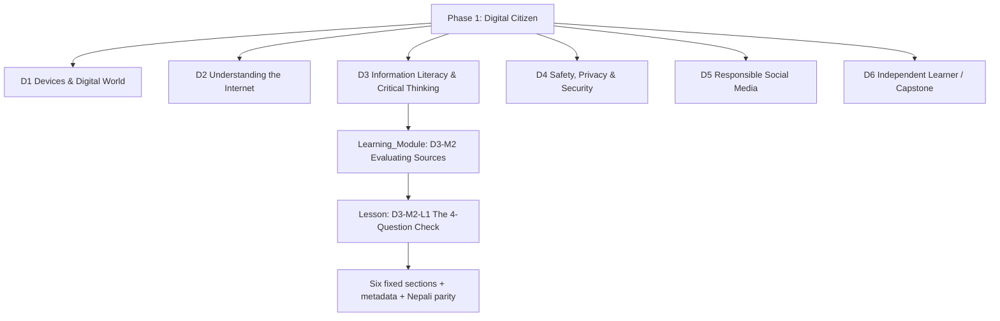
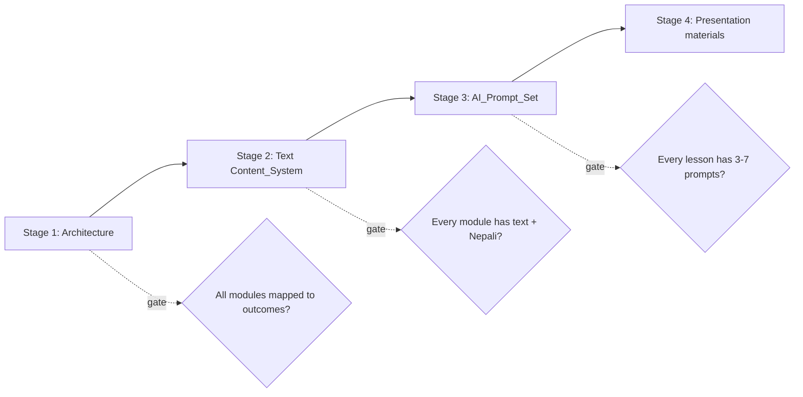
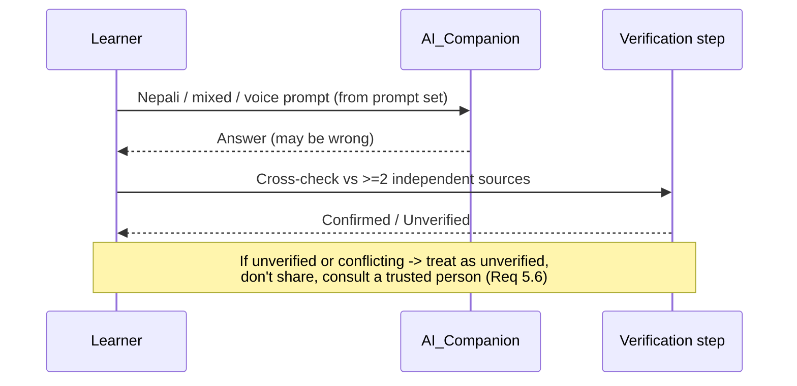
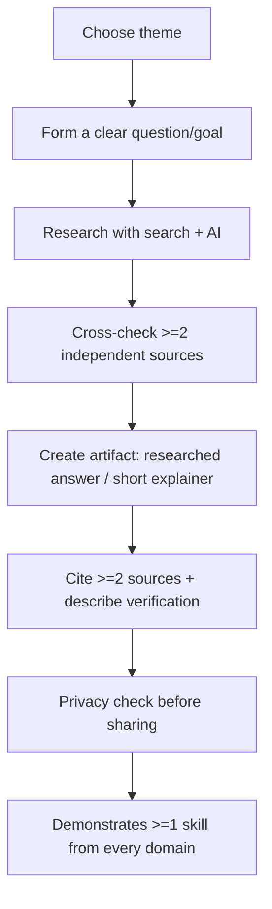

# Design Document

## Overview

This design describes **how the Phase 1: Digital Citizen curriculum is structured, authored, validated, and delivered** as a file-based, bilingual (English + Nepali), smartphone-first learning product for a Nepal NGO serving first-generation digital learners aged 12–18.

The "system" being designed is **not a software application**. It is a curriculum-as-a-product: a structured collection of content artifacts (domains, modules, lessons, AI prompt sets, Nepali translations, facilitator guides) plus the metadata, templates, and authoring/validation processes that hold them together. The `AI_Companion` is treated as an **external tool the curriculum is designed around** — this document specifies the prompt design, language handling, and safety guardrails the curriculum imposes on AI use, not the AI tool's implementation.

### Design Goals

1. **Outcome-driven** — every Learning_Module traces to at least one Phase_1_Outcome before any lesson is written (Req 1).
2. **Disciplined authoring pipeline** — content is produced in strict stages: Architecture → Text Content → AI Prompts → Presentation materials (Req 1).
3. **Accessible by construction** — low-English text, full Nepali parity, term-before-use definitions, and a safety-first non-fear tone are enforced as authoring rules, not left to author judgment (Req 13, 15).
4. **Works in the real conditions** — fully completable on one entry-level smartphone, tolerant of intermittent internet and shared/family devices (Req 14).
5. **AI-assisted, not AI-dependent** — every AI interaction is paired with a verification step and scope/safety guardrails (Req 9, 5, 3).
6. **Facilitator-supportable** — a low-tech facilitator can deliver any lesson from its guide (Req 16).

### Design Principles (carried from the pedagogy)

- Teachers are mentors and learning architects; AI is a companion; the Learner does the thinking.
- Every risk is paired with a constructive action (no fear without a remedy).
- Local-first: examples come from rural Nepali daily life (marketplaces, agriculture, football, festivals).
- Nothing in Phase 1 requires coding, productivity software, certifications, or admin configuration.

## Requirements Traceability (high-level map)

| Design area | Requirements covered |
|---|---|
| Curriculum architecture & IDs | 1, 2 |
| Phase_1_Outcomes set & mapping | 1, 2 |
| Domain content design (D1–D6) | 3, 4, 5, 6, 7, 8 |
| Cross-cutting threads | 9, 10, 11 |
| Lesson_Template | 12 |
| Content_System & file layout | 1, 13, 14, 15 |
| AI_Prompt_Set design | 9, 12, 13, 5 |
| Assessment & Capstone | 5, 8, 17 |
| Facilitator_Guide | 16 |
| Rural/offline/shared-device & accessibility | 13, 14 |
| Quality gates & error handling | 1, 12, 13, 14, 16 |
| Testing strategy | all |

## Architecture

### Hierarchy

The curriculum is a four-level tree. Identifiers are stable and human-readable so they can be referenced from metadata, prompts, and traceability tables.



### Identifier Scheme (Req 1.1, 1.9)

| Entity | ID format | Example |
|---|---|---|
| Domain | `D{n}` | `D3` |
| Learning_Module | `D{n}-M{m}` | `D3-M2` |
| Lesson | `D{n}-M{m}-L{l}` | `D3-M2-L1` |
| Phase_1_Outcome | `O{nn}` | `O05` |
| AI prompt | `D{n}-M{m}-L{l}-P{p}` | `D3-M2-L1-P3` |
| Deferred topic | `DEF-{nnn}` | `DEF-007` |

Each Domain and Module records: `id`, `title` (English + Nepali), and `sequence` (ordinal position). These exist before any lesson body is authored (Req 1.1).

### Phase_1_Outcomes Set (Req 1.9, 2.1)

The master goals become a fixed, ID'd outcome set. Every Module maps to ≥1 outcome; the architecture is rejected from approval if any Module is unmapped (Req 1.2, 1.3).

| ID | Phase_1_Outcome (observable) | Primary Domains |
|---|---|---|
| O01 | Operate a smartphone/computer to complete a named basic task unassisted | D1 |
| O02 | Explain what the internet is and reach information through a browser/app | D2 |
| O03 | Search effectively across web/image/video/maps/news/shopping and refine terms | D2 |
| O04 | Distinguish facts from opinions and apply a source-trust checklist | D3 |
| O05 | Recognize misinformation and cross-check a claim against ≥2 independent sources | D3 |
| O06 | Use the AI_Companion and verify its answers before relying on them | D3, D9-thread |
| O07 | Protect personal information and recognize a digital footprint | D4 |
| O08 | Recognize common scams and synthetic media, and respond safely | D4 |
| O09 | Use social media responsibly and build a positive digital identity | D5 |
| O10 | Recognize attention/emotional manipulation and apply a coping strategy | D5, D10-thread |
| O11 | Use mobile money safely (refuse + verify) | D4/D11-thread |
| O12 | Plan and complete a self-directed learning project (capstone) | D6 |

> The outcome list is the design's working set; final IDs/wording are confirmed during the Architecture authoring stage. Domain 3 is allocated the most lessons of any domain (Req 5.7, 5.8).

### Deferred-Topics Register (Req 2.4, 2.5)

A single register file records any proposed topic that belongs to a later phase or violates a Phase 1 boundary. Each entry: `id`, `topic`, `assigned_phase` (2/3/4), `reason` (e.g., "coding — excluded by Req 2.2", "admin configuration — Req 2.3"). The architecture-review gate routes rejected topics here rather than silently dropping them.

### Authoring Pipeline (Req 1.4, 1.5, 1.6)



No stage starts before its predecessor completes. The Content_System is "complete" only when every Learning_Module has authored text content (Req 1.5). Slides/animations/videos are excluded from the initial deliverables and, when later produced, are derived from and reference the source Content_System (Req 1.7, 1.8).

## Components and Interfaces

The curriculum is composed of a small set of artifact "components." Each has a defined responsibility and a defined interface (the structure other components and processes rely on).

| Component | Responsibility | Interface (what others depend on) |
|---|---|---|
| **Curriculum_Architecture** | Defines domains, modules, sequence, outcomes, deferred topics | Stable IDs (`D{n}`, `D{n}-M{m}`, `O{nn}`); outcome-mapping table |
| **Lesson** | A single unit of learning | Six fixed sections + front-matter metadata schema |
| **Lesson_Template** | Canonical lesson shape | The six-section contract every Lesson must satisfy |
| **Content_System** | All authored text + Nepali parity | `lesson.en.md` / `lesson.ne.md` pair per lesson; glossary |
| **AI_Prompt_Set** | Per-lesson structured prompts | `prompts.md` with prompt records referenced by `ai_prompt_ids` |
| **Facilitator_Guide** | Per-lesson delivery support | `facilitator.ne.md` keyed to the lesson ID |
| **Shared assets** | Glossary, project themes, safety playbook | Referenced by ID from lessons |

The sections that follow specify each component's design.

## Lesson_Template Design (Req 12)

Every Lesson is built from exactly six sections, in fixed order. A lesson missing a section or out of order is flagged incomplete and withheld from publication (Req 12.6).

| # | Section | Purpose | Key design rules |
|---|---|---|---|
| 1 | **Learning Goal** | States the one outcome this lesson serves | Names exactly one `Phase_1_Outcome` ID (Req 12.5) |
| 2 | **Starter Question** | Sparks curiosity from the learner's world | A relatable rural-Nepal scenario, asked in Nepali |
| 3 | **Guided AI Exploration** | Structured AI practice | 3–7 prompts from the `AI_Prompt_Set`, in Nepali, each with a verification step (Req 12.3, 9.4) |
| 4 | **Practical Activity** | Hands-on task | Completable on one smartphone, no extra device/paid service; includes an **offline alternative** (Req 12.4, 12.7, 14.1) |
| 5 | **Reflection** | Consolidate + self-check | Short prompts; for some lessons a self-check quiz (Req 10.4) |
| 6 | **Mini Project** | Apply to a chosen theme | Uses the learner's selected community theme (Req 17.2) |

### Embedded design threads in every lesson

- **AI literacy element** — at least one labeled AI touchpoint connecting the topic to AI use (Req 9.1).
- **Safety-first pairing** — any risk shown is paired, on the same screen, with a constructive action (Req 15.1, 15.5).
- **Term-before-use** — any technical term is defined in simple language + Nepali equivalent before first use (Req 13.7, 13.8).
- **Retry/relief path** — activities that a learner may struggle with provide a simplified walkthrough after repeated attempts (Req 3.6) and a distress pause-and-seek-help prompt where relevant (Req 10.5).

### Lesson metadata schema (front-matter)

Each lesson file carries machine-checkable metadata used by the quality gates:

```yaml
id: D3-M2-L1
title_en: "The 4-Question Source Check"
title_ne: "स्रोत जाँच्ने ४ प्रश्न"
domain: D3
module: D3-M2
outcomes: [O04, O05]
sequence: 1
reading_level: phase1-low-english
has_nepali: true              # gate: must be true to publish (Req 13.2/13.3)
max_sentence_words: 15        # authoring rule (Req 13.1)
ai_prompt_ids: [D3-M2-L1-P1, D3-M2-L1-P2, D3-M2-L1-P3]
offline_alternative: true     # gate for Practical Activity (Req 12.7, 14.3)
requires_connectivity: false
ai_literacy_element: true     # gate (Req 9.1)
safety_actions_paired: true   # gate (Req 15.5)
project_theme_aware: true     # (Req 17.2)
```

## Content_System & File Organization

A flat, predictable repository structure mirrors the ID scheme so any artifact is findable by ID. English and Nepali live side by side for every lesson (full parity, Req 13.2).

```
curriculum/
  architecture/
    outcomes.md                # Phase_1_Outcomes (O01..O12) with IDs
    domain-map.md              # Domains, Modules, sequence, outcome mapping
    deferred-topics.md         # Deferred-topics register
  domains/
    D3-information-literacy/
      D3.md                    # domain overview (en/ne)
      D3-M2-evaluating-sources/
        D3-M2.md               # module overview + outcome mapping
        D3-M2-L1/
          lesson.en.md         # English lesson (6 sections + front-matter)
          lesson.ne.md         # Nepali lesson (full parity)
          prompts.md           # AI_Prompt_Set for this lesson (Stage 3)
          facilitator.ne.md    # Facilitator_Guide (Nepali)
  templates/
    lesson-template.md         # the canonical six-section template
    facilitator-template.md
    prompt-template.md
  shared/
    glossary.md                # term -> simple def + Nepali (Req 13.7)
    project-themes.md          # selectable themes (Req 17.1)
    safety-playbook.md         # stop/don't-share/consult patterns (Req 6.7, 11.5)
```

### Content authoring rules (enforced by review/gates)

| Rule | Source |
|---|---|
| Sentences ≤ 15 words; everyday vocabulary; no undefined English jargon | Req 13.1 |
| 100% Nepali parity for instructions, examples, assessment | Req 13.2 |
| Define each technical term (simple + Nepali) before first use | Req 13.7 |
| ≤ 5 English loanwords per learning page (D1) | Req 3.1 |
| ≥ 1 local rural-Nepal example per lesson, in Nepali | Req 14.8 |
| Risk always paired with constructive action; no fear/shame language | Req 15.1, 15.5 |
| Hardware/OS topics conceptual only — no admin tasks | Req 2.3 |

## Data Models

These are the structured "data models" of the curriculum — the schemas that make the artifacts machine-checkable by the Quality Gates. (Full examples appear in the component sections above.)

### Lesson metadata
`id, title_en, title_ne, domain, module, outcomes[], sequence, reading_level, has_nepali, max_sentence_words, ai_prompt_ids[], offline_alternative, requires_connectivity, ai_literacy_element, safety_actions_paired, project_theme_aware` — see the Lesson_Template section for the canonical front-matter.

### Phase_1_Outcome
`id (O{nn}), statement_en, statement_ne, observable_check, primary_domains[]` — defined in `architecture/outcomes.md`.

### Domain / Learning_Module
`id, title_en, title_ne, sequence, outcomes_mapped[]` — defined in `architecture/domain-map.md`.

### AI prompt record
`id, goal_ne, prompt_ne, prompt_en (reference), verify_step_ne, guardrail` — see the AI_Prompt_Set section.

### Deferred-topic entry
`id (DEF-{nnn}), topic, assigned_phase, reason` — in `architecture/deferred-topics.md`.

### Project theme
`id, name_en, name_ne, is_default` — in `shared/project-themes.md`.

### Glossary term
`term, definition_simple_en, definition_ne, first_used_in` — in `shared/glossary.md`.

## Domain Content Design (D1–D6)

Each domain below lists its modules, the outcomes it serves, and the design notes that satisfy its requirement. Lesson counts are indicative; **Domain 3 must have strictly more lessons than any other domain and at least four** (Req 5.7, 5.8).

### D1 — Understanding Devices & the Digital World (Req 3) → O01

- **D1-M1 Technology Around Us** — what technology is; digital vs non-digital; ≥3 device categories (incl. smartphone + computer) with ≥2 everyday uses each.
- **D1-M2 Hardware vs Software** — conceptual difference, ≥2 everyday examples per concept; OS as "the program that lets you control the device and open apps," with a smartphone example.
- **D1-M3 First Hands-On** — Practical Activity with observable success (power on/off, open a named app, adjust brightness/volume); AI hints scoped to the task; simplified walkthrough after 3 attempts.

### D2 — Understanding the Internet (Req 4) → O02, O03

- **D2-M1 What Is the Internet** — internet vs Wi-Fi, websites, browsers, apps; ≥3 rural-life examples.
- **D2-M2 Ways to Search** — guided practice for each of 6 result types (web/image/video/maps/news/shopping).
- **D2-M3 Modern & AI Search** — AI-powered vs keyword search (≥2 differences); recommendation algorithms (≥2 factors, ≥1 consequence).
- **Search-skills rules**: refine terms with ≥2 named techniques; recovery steps when no/irrelevant results; safe-search on and avoid results requesting personal info/payment (Req 4.5–4.7).

### D3 — Information Literacy & Critical Thinking (Req 5) → O04, O05, O06 (largest domain)

- **D3-M1 Facts vs Opinions** — observable test + ≥3 paired examples from rural life.
- **D3-M2 Evaluating Sources** — the named 4-question source-trust checklist (who/when/why/evidence).
- **D3-M3 Spotting Misinformation** — ≥2 warning signs; cross-check against ≥2 independent sources.
- **D3-M4 Trusting AI Well** — AI_Hallucination defined in Nepali; ≥2 verification techniques; "unverified → don't share → consult a trusted person" (Req 5.6).
- **D3-M5 Learning With AI** — asking better questions, follow-ups, summaries, translations — feeds the capstone.

### D4 — Digital Safety, Privacy & Security (Req 6) → O07, O08, O11

- **D4-M1 Digital Footprint** — defined in Nepali; ≥3 everyday smartphone actions that add to it.
- **D4-M2 Private Information** — ≥5 categories with a concrete risk each.
- **D4-M3 Passwords & Accounts** — strong-password rule (≥8 chars, ≥3 of 4 types); ≥3 smartphone account-security actions.
- **D4-M4 Scams & Synthetic Media** — ≥4 context scams with warning signs; deepfakes/AI media with ≥2 cues.
- **D4-M5 Digital Money Safety** (money thread) — how wallets work conceptually; ≥3 scams; refuse+verify; framed as safety not finance (Req 11).
- **Safety response pattern** (Req 6.7): stop → don't share info/money → consult a named trusted person, stored once in `shared/safety-playbook.md` and referenced by lessons.

### D5 — Responsible Social Media Use (Req 7, 10) → O09, O10

- **D5-M1 Why Social Media Exists** — purpose of ≥3 platforms common in rural Nepal, worked example each.
- **D5-M2 The Attention Economy** — ≥3 design techniques (infinite scroll, notifications, autoplay) and how each increases time spent.
- **D5-M3 Emotional & Attention Self-Defense** (emotion thread) — comparison/FOMO/rage-bait defined in Nepali with examples; ≥2 coping strategies as observable steps; self-check activity; distress pause-and-seek-help (Req 10).
- **D5-M4 Posting & Communicating Responsibly** — ≥5 avoid-to-post categories; ≥4 respectful-communication behaviors (positive/negative example each); ≥3 practice scenarios; simulated content only, never a live post (Req 7.8).
- **D5-M5 Positive Digital Identity** — ≥3 concrete actions.

### D6 — Becoming an Independent Learner / Capstone (Req 8, 17) → O12

- **D6-M1 Learning Anything** — search + AI + video + reading combined.
- **D6-M2 Better Questions & Trustworthy Resources** — formulate/rephrase/narrow questions; check creator, compare ≥2 sources, spot unreliable content.
- **D6-M3 Plan Your Project** — goal, steps, target timeframe; choose a community theme.
- **D6-M4 Capstone** — produce a Capstone_Artifact (researched answer or short explainer) on a chosen topic in Nepali/primary language; cite ≥2 sources + describe verification; privacy check before sharing; demonstrate ≥1 skill from every domain; facilitator-supported fallback (Req 8).

### Cross-Cutting Threads (tracked, not siloed)

| Thread | How it is woven | Requirements |
|---|---|---|
| **AI literacy** | ≥1 labeled AI element in every domain; ≥3 domains point out AI the learner already uses (search/keyboard/feeds); AI-assisted vs AI-dependent principles + contrasting example | 9.1, 9.2, 9.5 |
| **Emotional/attention self-defense** | Anchored in D5-M3 but reflection prompts elsewhere reinforce it | 10 |
| **Digital money safety** | Anchored in D4-M5; refuse+verify pattern reused from the safety playbook | 11 |

A thread-coverage matrix (thread × domain) is maintained in `architecture/domain-map.md` so reviewers can confirm each thread appears where required.

## AI_Prompt_Set Design (Req 9, 12, 13, 5)

Stage 3 authors a `prompts.md` for each lesson, produced only after that lesson's text content exists. Each lesson has **3–7 prompts** presented in Nepali.

### Prompt record format

```yaml
- id: D3-M2-L1-P2
  goal_ne: "विद्यार्थीले स्रोत कसले बनायो भन्ने पहिचान गर्न सक्ने"   # what the learner practices
  prompt_ne: "मैले भेट्टाएको यो जानकारी कसले लेखेको हो र किन लेखेको होला भनेर मलाई सोध्न मद्दत गर"
  prompt_en: "Help me ask who wrote this information I found and why."   # reference only
  verify_step_ne: "AI को जवाफलाई कम्तीमा २ फरक स्रोतसँग मिलाएर हेर"      # mandatory (Req 9.4, 5.5)
  guardrail: scope_limited_no_personal_info
```

### Guardrail patterns the curriculum imposes on AI use

| Guardrail | Behavior designed into the prompt/lesson | Requirements |
|---|---|---|
| **Verify-before-rely** | Every prompt carries a `verify_step` (cross-check ≥2 independent sources) | 9.4, 5.5 |
| **Scope-limited** | Prompts keep the AI on the lesson task; do not request personal/sensitive info | 3.5 |
| **AI-assisted not dependent** | Lessons state the principle + a contrasting example; reflection asks the learner to judge the AI's answer | 9.2 |
| **Language flexibility** | Prompts authored in Nepali; AI expected to accept Nepali/English/mixed and voice; on 2 failed voice tries, fall back to text keeping context | 13.4, 13.5, 13.6 |
| **Hallucination awareness** | D3-M4 explicitly names hallucinations; verification techniques reused everywhere | 5.4 |

### AI interaction flow (per guided exploration)



## Assessment & Capstone Design (Req 5, 8, 10, 17)

### Observable checks

Assessment is behavior-based, matching the outcome wording (Req 2.1). Examples: "classify this content as trustworthy/suspicious and give one reason," "identify the design technique and name an emotional effect" (self-check, Req 10.4). No certification or exam-prep framing (Req 2.2).

### Project themes (Req 17)

`shared/project-themes.md` lists ≥5 themes (football, art, farming, local festivals, local marketplaces), shown in Nepali before the Mini Project/Capstone. A learner may select, change theme without losing progress, or get a default if none chosen. An off-list proposed theme is allowed only if it has no personal/sensitive info and is safety-conformant; otherwise rejected with a redirect to the list.

### Capstone artifact



Alternative artifact formats are allowed if they still demonstrate the required skills (Req 8.6). If a learner cannot complete independently, the facilitator provides guided support while the learner still performs the required skills (Req 8.10).

## Facilitator_Guide Design (Req 16)

One `facilitator.ne.md` accompanies every lesson, written in plain Nepali understandable by a facilitator with basic schooling, with no untranslated English technical terms (Req 16.2).

Structure per guide:

1. **Learning objectives** (the lesson's outcome IDs in plain language).
2. **Numbered delivery sequence** — step-by-step flow of the lesson.
3. **Estimated duration** in minutes.
4. **Required materials & smartphone setup steps**.
5. **On-screen navigation steps** — numbered taps/screens for any hands-on smartphone activity (Req 16.5).
6. **AI supervision notes** — how to spot an unsafe or incorrect AI_Companion response and the exact steps to take (Req 16.4).
7. **Facilitator role reminder** — mentor and learning architect who guides learners to find answers, not the sole answer source (Req 16.3).
8. **Escalation procedure** — for unsafe/distressing content or AI responses: what to do and whom to report to (Req 16.6).

## Rural, Offline-Aware, Shared-Device & Accessibility Design (Req 13, 14)

| Concern | Design realization |
|---|---|
| Smartphone-first | Every activity completable on one entry-level smartphone; no activity needs a second device (Req 14.1) |
| Computer lab | Deliverable with ≥5 shared computers; no activity requires one-learner-per-computer (Req 14.2) |
| Intermittent internet | Each lesson marks `requires_connectivity`; ≥80% of core activities have an offline path; connectivity needs stated before the activity; internet-only activities can be deferred without losing progress (Req 14.3–14.5) |
| Shared/family devices | No activity stores personal credentials/logins/PII on the device; learners are told to clear personal data before passing the device on (Req 14.6, 14.7) |
| Language parity | English + Nepali files for every lesson; AI accepts Nepali/English/mixed + voice (Req 13.2–13.6) |
| Glossary | `shared/glossary.md` holds simple definition + Nepali for each term, surfaced on demand (Req 13.7, 13.8) |
| Age range | Built for 12–18; open to ages 10–20 without restriction; outside that, access allowed with an out-of-range note (Req 15.3, 15.4) |

## Delivery and Tooling Model

The curriculum content is delivery-neutral (plain bilingual text is the source of truth), but it is delivered through two tiers. **Tier 1 (the computer lab) is the primary, full experience; Tier 2 (mobile) provides the basic learning context** so a learner can keep reading and reviewing away from the lab.

### Tier 1 — Computer Lab (primary)

Delivered on the NGO's shared computers (Chrome/Edge), where the **Sabda browser extension** acts as the curriculum's `AI_Companion` and reading-support layer. Lessons are opened as web pages or PDFs inside Sabda, and the existing Sabda features cover most of what the lesson sections need:

| Lesson element | Sabda feature used |
|---|---|
| Guided AI Exploration prompts (Req 9, 12.3) | "Ask Sabda" chat |
| Term-before-use, Nepali meaning (Req 13.7) | Inline word lookup + translation (offline Nepali dict for common words) |
| Read support for weak readers / voice (Req 13.5) | Built-in PDF reader + Read Aloud (TTS) |
| Self-check activities (Req 10.4) | Learn tab quizzes |
| Reflection + capstone drafting (Req 8) | Notes |
| Learning plan: goal/steps/timeframe (Req 8.1) | Tasks / Plans |

This means the AI-companion layer the curriculum is designed around already largely exists; Tier 1 needs little new integration to pilot — lessons are authored as text, published simply, and opened inside Sabda.

### Tier 2 — Mobile (basic learning context)

Browser extensions do not run on mobile Chrome, so Sabda's full toolset is **not** available on phones. Mobile therefore delivers the **basic learning context**: the lesson text in Nepali (and English), readable on a phone, plus activities that use the phone's own standard apps (browser, camera, messaging) rather than Sabda. AI assistance on mobile, if used, is via a standard AI app/website the learner opens directly, using the same Nepali prompts from the lesson.

This refines requirement 14.1 ("fully completable on a single smartphone"): the **full AI-companion experience is lab-first**, while the **core reading/learning content remains available on mobile**. The offline path (Req 14.3) and shared-device hygiene (Req 14.6, 14.7) apply to both tiers.

> Note: this is a deliberate refinement of Req 14.1. If accepted, Req 14.1 should be updated to distinguish "full experience (lab)" from "basic content (mobile)". Sabda is treated here as an external tool the curriculum is designed around, not part of the curriculum deliverable.

### Integration approach (staged, matches the content-first pipeline)

**Chosen delivery format: a static course website generated from the text.** The bilingual Markdown lessons are compiled by a reusable template into an interactive, offline-capable static site (no backend, no accounts, no server). The site presents the six lesson sections and can embed self-check quizzes, tap-to-reveal Nepali, copyable "Ask Sabda" prompts, and simple progress. It runs in the lab alongside Sabda (the AI/translation/read-aloud layer), can be copied to lab machines as an offline bundle or installed as a PWA for poor connectivity, and opens in a mobile browser for the Tier 2 basic-content experience.

A key design intent: the **reusable asset is the pipeline** (structured Markdown + curriculum architecture + site template), so future courses for other subjects and communities are produced mainly by authoring new content into the same template, not by building new software.

1. **Link / open-in-Sabda (pilot):** publish the generated site (or text lessons) and have students open it in Sabda in the lab, using its existing define / translate / read-aloud / Ask features. Minimal new code.
2. **Deeper integration (later, optional):** a dedicated "Course" surface in Sabda that loads lessons, tracks progress, and feeds each lesson's prompts into Ask Sabda — considered only after a content pilot.
3. **Shared upload/accounts (future, out of scope now):** any model where students upload work or a class is managed centrally would require backend/accounts that Sabda (local-first, no server) does not currently have.

### Distribution to the lab

The static site is distributed either by (a) hosting it at a single URL the instructor opens on each machine, or (b) copying the offline site bundle to the lab computers so it runs without internet. Both avoid per-machine installation of custom software; Sabda is installed once per browser as the AI-companion layer.

### Hosting & platform decision

**Decision: own static site, not a hosted course platform (Udemy/Teachable).** For this context the hosted platforms are a poor fit: they are online-only (our lab has intermittent internet and an offline requirement), carry ongoing cost or marketplace models unsuited to a free NGO program, require student accounts/emails (privacy burden for rural teens), are English-first (we need bilingual EN↔Nepali), and lock content into a video+quiz format that can't host our interactive diagrams or the Sabda integration. Phase 1 also deliberately excludes certificates — a key thing those platforms sell.

- **Primary:** the self-owned static site (free, offline-capable, bilingual, no accounts, fully owned, pairs with Sabda). Copied to lab machines.
- **Also:** host the same site for free online (GitHub Pages / Netlify / Cloudflare Pages) for a public URL at no recurring cost.
- **Video:** use YouTube only for video (free, works on cheap phones, offline-downloadable, low-bandwidth) — embed/link from lessons rather than self-hosting heavy media.
- **Revisit only if scaling** to many online, self-paced learners needing payments/certificates/zero-maintenance: evaluate **Moodle** first (free, open-source, self-hostable, offline-installable, education-focused) before any paid marketplace. Content is plain Markdown, so exporting to a platform later is low-effort — building the static site now does not lock us out.

### Future: AI-assisted video walkthroughs (self-learner support)

Each lesson may later include an optional short **narrated-slide video** (MLU-style: simple slides + voiceover) for self-paced learners. This is "presentation materials derived from the text" (Requirement 1.8): the lesson Markdown is the source, slides are generated from it, and narration is added.

- **Pipeline options:** AI slide generation from lesson text + text-to-speech voiceover; or a NotebookLM-style narrated "Video Overview" from the lesson source.
- **Language caveat:** narration must be Nepali. AI Nepali TTS quality is uneven — plan a human Nepali voiceover for the most important lessons and AI voice for the rest; quality-test before committing.
- **Delivery:** keep videos short, host on YouTube (offline-downloadable), embed/link from the lesson. A lesson can carry an optional `video` field so the site shows a player when a video exists.
- Caveat: screenshots/UIs change, so keep videos cheap to regenerate.

## Quality Gates (authoring/review process)

Gates are checks run during authoring and review; a failing gate withholds the artifact from publication, preserving the draft for correction.

| Gate | Condition to pass | Requirement | On failure |
|---|---|---|---|
| Outcome-mapping gate | Every Module maps to ≥1 outcome | 1.2, 1.3 | Flag module, withhold approval |
| Sequencing gate | No stage begins before predecessor complete | 1.4, 1.6 | Reject out-of-sequence work, name incomplete stage |
| Content-complete gate | Every Module has text content | 1.5 | Block Stage 3 start |
| Translation gate | `has_nepali: true` + full parity | 13.2, 13.3 | Withhold lesson, mark missing-translation |
| Lesson-structure gate | Six sections present, in order | 12.1, 12.2, 12.6 | Flag incomplete, exclude from publication |
| Prompt-count gate | 3–7 prompts, each with verify step | 12.3, 9.4 | Block lesson publication |
| Offline gate | Practical Activity has offline alternative | 12.7, 14.3 | Flag lesson |
| Scope gate | No excluded topic / admin task | 2.2, 2.3, 2.5 | Route to deferred-topics register |
| Tone gate | Risks paired with action; no fear/shame language | 15.1, 15.5 | Return for rewrite |
| AI-literacy gate | ≥1 labeled AI element per domain | 9.1 | Flag domain |

## Error Handling

The following table maps the IF/THEN requirement cases to defined handling in the curriculum and authoring process.

| Situation | Designed handling | Requirement |
|---|---|---|
| Unmapped Learning_Module | Flagged; withheld from approval until mapped | 1.3 |
| Out-of-sequence authoring | Work rejected; incomplete predecessor stage indicated | 1.6 |
| Lesson missing/!ordered sections | Flagged incomplete; excluded from publication; draft retained | 12.6 |
| Missing Nepali translation | Lesson withheld; missing-translation status shown to author | 13.3 |
| Learner can't complete activity in 3 tries | Simplified guided walkthrough; retry without losing progress | 3.6 |
| Search returns nothing/irrelevant | ≥2 recovery steps offered | 4.6 |
| Claim unverifiable / sources conflict | Treat as unverified; don't share; consult trusted person | 5.6 |
| Suspected scam/unsafe | Stop → don't share → consult trusted person | 6.7 |
| Unexpected money/credential request | Refuse + verify via trusted channel; if unverifiable, take no action, share nothing, seek help | 11.5, 11.6 |
| Content triggers distress | Nepali safety prompt: pause, seek trusted adult/facilitator | 10.5 |
| Voice input not understood (2 tries) | Prompt retry or switch to text; keep context | 13.6 |
| Learner can't complete capstone alone | Guided facilitator support; learner still performs required skills | 8.10 |
| Off-list/unsafe project theme | Reject; redirect to approved theme list | 17.5 |
| Participant outside 10–20 | Access allowed with out-of-range note | 15.4 |

## Correctness Properties

These are invariants the curriculum must always satisfy. They are the basis of the Quality Gates and the traceability checks.

### Property 1: Outcome coverage
Every Learning_Module maps to ≥1 Phase_1_Outcome, and every Phase_1_Outcome is served by ≥1 Module (no orphans in either direction).
**Validates: Requirements 1.2, 1.3**

### Property 2: Authoring order
For any artifact, its predecessor stage is complete before it exists (Architecture → Content → Prompts → Presentation).
**Validates: Requirements 1.4, 1.6**

### Property 3: Lesson completeness
Every published Lesson has exactly the six template sections, in order.
**Validates: Requirements 12.1, 12.2**

### Property 4: Language parity
Every published Lesson has complete Nepali content for all instructions, examples, and assessments.
**Validates: Requirements 13.2**

### Property 5: Domain 3 dominance
Domain 3 has strictly more Lessons than any other Domain and at least four.
**Validates: Requirements 5.7, 5.8**

### Property 6: Verify-before-rely
Every AI prompt carries a verification step.
**Validates: Requirements 9.4, 5.5**

### Property 7: Risk-action pairing
Every risk/threat statement is paired, on the same screen, with a constructive action.
**Validates: Requirements 15.1, 15.5**

### Property 8: Lab-first, mobile-basic availability
The full experience (AI_Companion-assisted activities) is available in the Computer_Lab; the core learning content (lesson text in Nepali/English and review activities) is available on a single smartphone.
**Validates: Requirements 14.1, 14.2**

### Property 9: Scope integrity
No Phase 1 artifact contains an excluded topic or an admin-configuration task; violations live only in the deferred-topics register.
**Validates: Requirements 2.2, 2.3, 2.5**

### Property 10: AI literacy presence
Each of the six Domains contains at least one labeled AI literacy element.
**Validates: Requirements 9.1**

## Testing Strategy

Because the deliverable is curriculum content (not software), "testing" means content validation, traceability, and human pilot testing.

1. **Traceability check** — automated/review pass confirming every Module maps to an outcome and every requirement maps to ≥1 design element and ≥1 lesson (forward + backward).
2. **Gate validation** — run the Quality Gates table against every lesson before publication; treat each gate as a pass/fail test.
3. **Readability & language audit** — sample lessons checked for sentence length, loanword limits, term-before-use, and Nepali parity.
4. **Safety/tone audit** — confirm every risk statement is paired with a constructive action and no fear/shame language; verify the safety-playbook patterns are referenced where needed.
5. **Offline/shared-device dry run** — deliver a sample lesson with connectivity disabled and on a shared device to confirm the offline path and no-PII-stored rules hold.
6. **AI guardrail check** — exercise each prompt set to confirm verification steps trigger and the AI stays in scope and refuses personal-info requests.
7. **Facilitator pilot** — a low-tech facilitator delivers a lesson using only the guide; gaps feed back into the guide.
8. **Learner pilot** — small cohort runs a domain; observe whether outcomes are demonstrably met and capture confusion points for revision.

Pilot findings loop back into the relevant authoring stage rather than patching downstream artifacts, preserving the architecture-first discipline.

## Time to Complete

Estimated facilitated (in-lab) time, summed from the per-lesson estimates in the
facilitator guides:

| Chapter | Content | Estimated time |
|---|---|---|
| D1 Devices & the Digital World | 4 lessons + review | ~3 hours |
| D2 Understanding the Internet | 4 lessons + review | ~3 hours |
| D3 Information Literacy | 6 lessons + review | ~5 hours |
| D4 Safety, Privacy & Security | 5 lessons + review | ~4 hours |
| D5 Responsible Social Media | 5 lessons + review | ~4 hours |
| D6 Independent Learner + Capstone | 4 lessons + review | ~5 hours |
| **Total** | **34 pages** | **≈ 24 hours** (range ~22–26) |

- Per lesson: ~40–45 min (content), ~15–40 min (review); the capstone is 2–3 sessions.
- Pacing: about **35–38 short sessions (~45 min)** → **~12 weeks at 2–3 classes/week**
  (one school term), or ~7–8 weeks at 5 classes/week.
- Self-paced on a phone (reading + offline quizzes, no group hands-on):
  roughly **9–12 hours** total, plus the capstone.
- Audience note: estimates assume first-generation, low-English beginners; the pace suits
  learners of **any age** who lack digital literacy. Lean to the upper end (~26 hrs) for
  mixed-age or older absolute-beginner groups.
